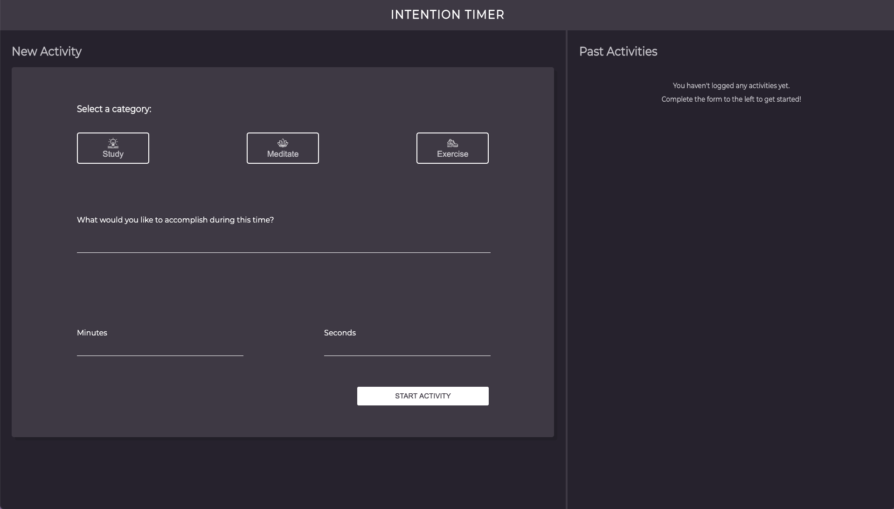
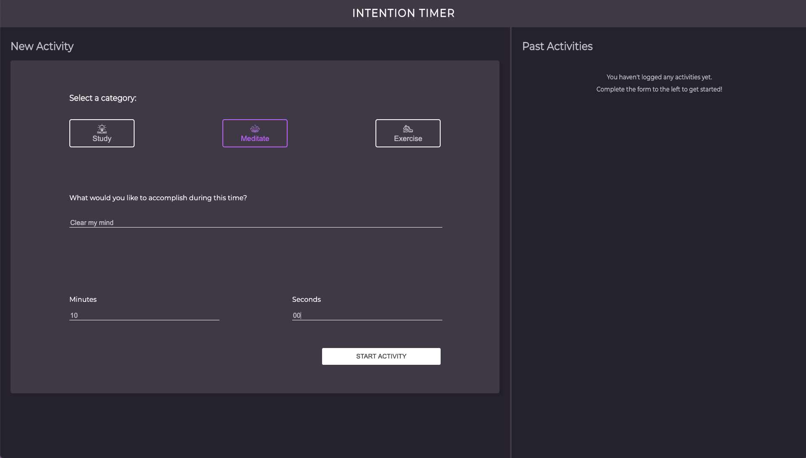
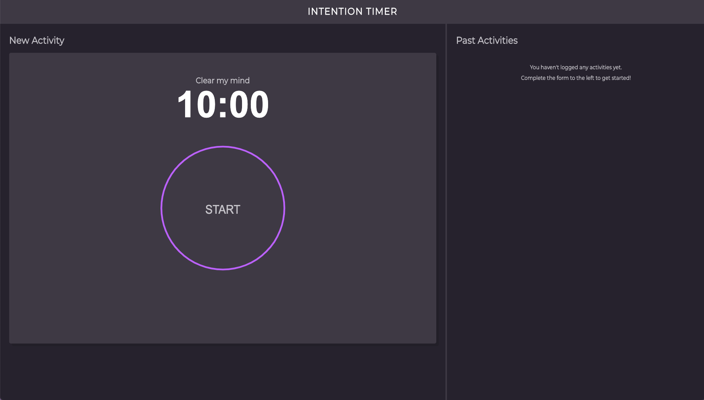
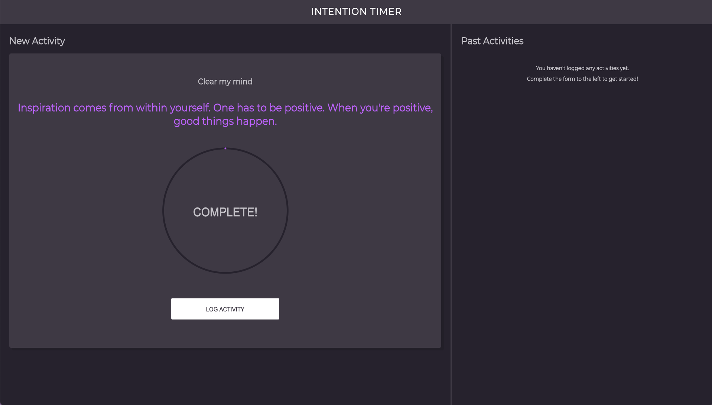
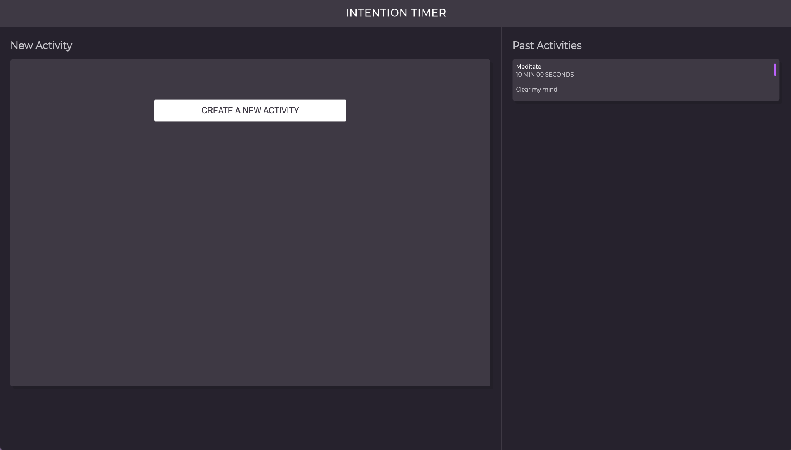

# Intention-Timer

## Contributors

* Connor Anderson-Larson
* Jim Charnesky
* Joel Thomas

## Technologies Used:

* JavaScript
* CSS
* HTML

## Deploy Link:

* [Intention Timer](https://connorandersonlarson.github.io/Intention-Timer/)

## How to Use:

* First you will want to choose the category of your intention. Within this category, you will want to establish what you would like to accomplish during your time. Decide on a time frame for this accomplishment, and then click the 'START ACTIVITY' button.

* The page will switch to a timer with what you would like to accomplish. Click on 'START' to start the countdown on your timer!

* Once your timer has completed, an inspirational message will pop up to warm your heart, and your soul! You can then click on the 'LOG ACTIVITY' button at the bottom of the page to save your accomplishment in the 'Past Activities' section to the right.

* You will then be prompted to start a brand new activity.

* Feel free to come and go as you please on this webpage, as your past activities will be saved and displayed for all of time! If your 'Past Activities' section is looking full, you can scroll down to see your earliest accomplishments.

### Future Additions

* Accomplishment reflections
* Save favorite accomplishment cards and allow accomplishemnt repetition.
* Ability to delete past accomplishment cards.
* Pause functionality
* Cross device functionality
* Add audio component to timer completion.
